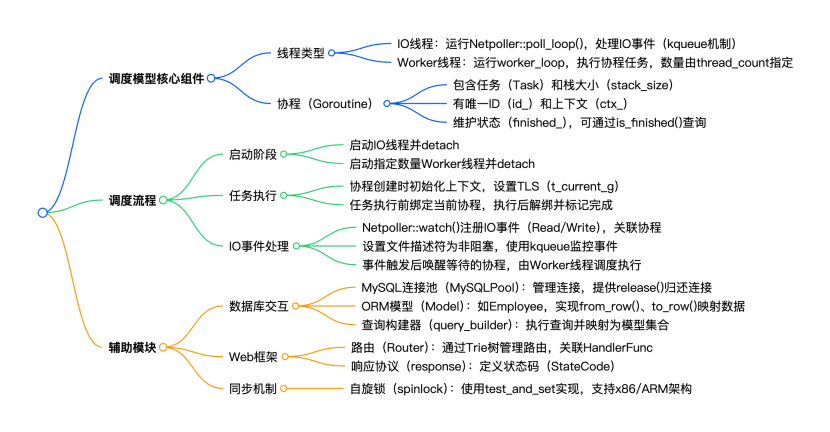
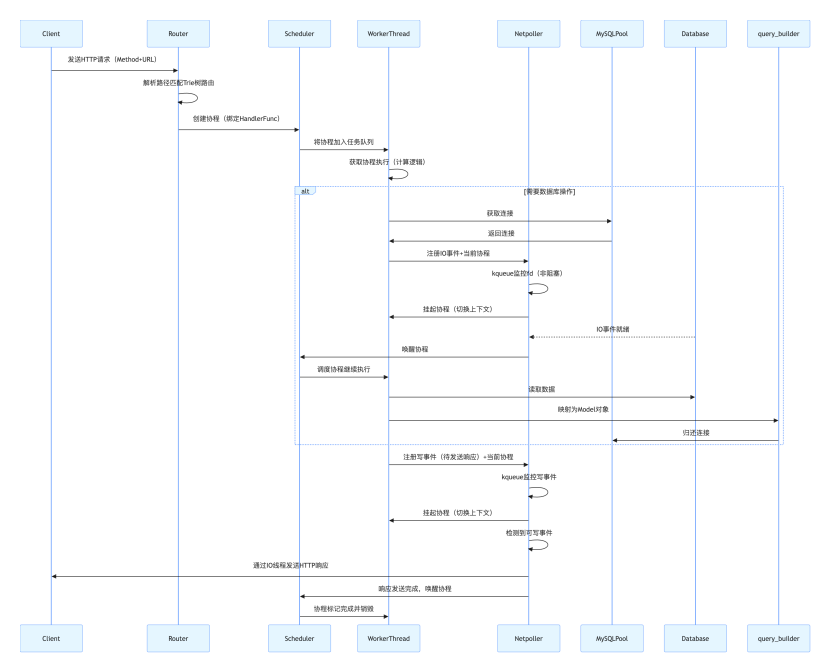

## 🚀 性能对比总览（Java vs Go(Gin) vs C++）

| 监控指标 | Java（Spring Boot） | Go（Gin 框架） | C++（自研协程框架） | C++ 相对 Java 提升 |
|---------|--------------------|---------------|---------------------|--------------------|
| **每秒请求数 (Req/s)** | 86.39 | 198.20 | **315.19** | **+265% 🚀** |
| **吞吐带宽 (MB/s)** | 105.54 MB | 241.87 MB | **386.53 MB** | **+266% 🚀** |
| **平均延迟 (Latency)** | 1320.00 ms | 793.58 ms | **626.67 ms** | **快 1.1 倍** |
| **99% 分位延迟 (P99)** | 2.00 s | 1.93 s | **0.96 s** | **稳 1 倍以上** |
| **超时错误 (Timeout)** | 2181 | 572 | **0** | **极致可靠** |
| **测试内存占用** | 2.5 GB | 100 MB | **100 MB** | **仅为 Java 的 4%** |

